# Verifiable Random Game — 系统架构设计文档

| 属性 | 内容 |
|------|------|
| **文档类型** | 系统设计阶段（SDD / High-Level Design） |
| **版本** | 1.0 |
| **状态** | 设计基线（Design Baseline）— 与当前 Demo 实现对齐 |
| **读者** | 课程评审、开发团队、后续维护者 |
| **关联文档** | [contracts.md](./contracts.md)（合约 API）、[README.md](../README.md)（运行指南） |

---

## 1. 文档目的

本文档在**项目立项与编码之前**定义 Verifiable Random Game 的系统边界、架构原则、逻辑组件与关键设计决策，作为后续智能合约、前端与测试实现的**设计基线**。

与「实现说明」的区别：

| 维度 | 本文档（设计阶段） | contracts.md / README |
|------|-------------------|------------------------|
| 关注点 | 为什么这样设计、需求与权衡 | 接口细节、命令与配置 |
| 抽象层级 | 子系统、域模型、流程 | 函数签名、环境变量 |
| 变更时机 | 需求或架构变更时修订 | 随代码同步更新 |

---

## 2. 项目背景

### 2.1 问题陈述

链上博彩/抽奖类应用若使用 `blockhash`、矿工可影响的伪随机源，玩家无法验证公平性，运营方也存在操纵空间。课程项目要求构建一个**可演示、可审计**的去中心化游戏平台，证明随机结果来自可验证外部源（Chainlink VRF 模型），且资金流转透明。

### 2.2 产品定位

- **类型**：可验证公平的链上游戏 **Demo 平台**（非生产级博彩产品）
- **玩法**：乐透加权抽奖、骰子倍率投注（二选一扩展更多 `VRFGameBase` 子类）
- **运行环境**：优先本地 Anvil + Mock VRF，预留 Sepolia 对接真实 VRF
- **用户**：课堂展示、本地开发、评审演示

### 2.3 设计范围

**范围内（In Scope）**

| 能力 | 说明 |
|------|------|
| 可验证随机 | VRF 请求—回调—链上证明记录 |
| 统一金库 | ETH 投注入金、派彩、可配置 house edge |
| 乐透 | 时间窗口、加权票、滚存 |
| 骰子 | Commit-Reveal、三种玩法与倍率 |
| Web 前端 | 钱包连接、玩法 UI、VRF 证明查询 |
| 本地全链路 | 部署脚本、Mock 协调器、测试 |

**范围外（Out of Scope — 初版）**

- 主网生产部署与合规审计
- 子图/后端索引服务
- 可升级代理合约
- 多签治理与 Timelock（列为演进项）
- 移动端原生 App、法币支付

---

## 3. 用例

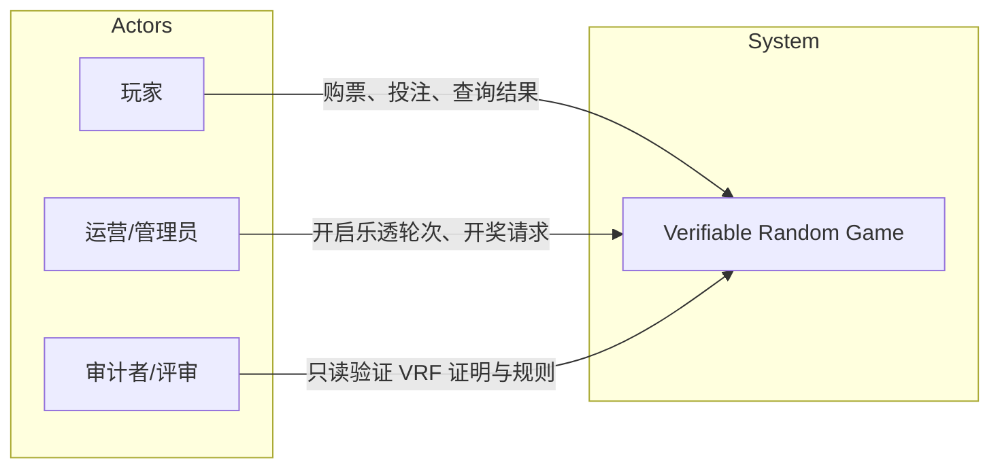

### 3.1 用例摘要

| 用例 ID | 名称 | 主要参与者 | 简述 |
|---------|------|------------|------|
| UC-01 | 连接钱包 | 玩家 | 通过 MetaMask 连接本地链或测试网 |
| UC-02 | 参与乐透 | 玩家 | 在开放轮次内按金额购票 |
| UC-03 | 管理乐透轮次 | 管理员 | 开启/关闭轮次、触发 VRF 开奖 |
| UC-04 | 骰子投注 | 玩家 | Commit → 等待 → Reveal 并下注 |
| UC-05 | 查询 VRF 证明 | 玩家/审计者 | 按 `context` 读取链上 `VRFProofRecord` |
| UC-06 | 金库参数管理 | 管理员 | 调整 house edge、授权游戏、提取费用（owner） |

---

## 4. 需求规格

### 4.1 功能需求

| ID | 需求 | 验收要点 |
|----|------|----------|
| FR-01 | 随机数可链上追溯 | 每次游戏随机请求有 `requestId`、`randomWords`、状态与时间戳 |
| FR-02 | 乐透公平开奖 | 中奖概率与投注权重成正比；无人中奖时奖池滚存 |
| FR-03 | 骰子防窥探 | 下注前仅上链 commitment；Reveal 前无法从 mempool 获知其预测 |
| FR-04 | 资金隔离 | 大额资金由金库托管；游戏合约仅短暂中转 ERC-20 |
| FR-05 | 派彩可计算 | 倍率与 house edge 公式固定，链上可复算 |
| FR-06 | 前端可读证明 | 无需后端即可 `eth_call` 查询 VRF 记录 |
| FR-07 | 本地可完整演示 | Anvil + Mock VRF 下可跑通购票至结算 |

### 4.2 非功能需求

| ID | 类别 | 目标 |
|----|------|------|
| NFR-01 | 可维护性 | 游戏逻辑与 VRF、金库解耦；新游戏继承 `VRFGameBase` |
| NFR-02 | 安全性 | 重入防护、授权调用金库、CEI 派彩顺序 |
| NFR-03 | 可测试性 | Foundry 单元测试 + 金库不变量测试；Mock VRF 可控随机数 |
| NFR-04 | 可观测性 | 丰富事件供前端与未来索引器订阅 |
| NFR-05 | 开发体验 | Monorepo；一键 `Deploy.s.sol`；前端环境变量配置地址 |
| NFR-06 | 性能（Demo） | 乐透轮次参与人数适中；接受 O(n) 选票扫描（初版权衡） |

---

## 5. 架构原则与约束

### 5.1 设计原则

1. **随机性外置（Oracle Pattern）**  
   链上不自行生成「安全随机数」；由 VRF 协调器回调提供，链上只存证明与业务推导。

2. **单一资金真相源（Single Treasury）**  
   所有玩法共用一个 `GameTreasury`，避免多池分散与对账复杂。

3. **模板方法扩展（Template Method）**  
   `VRFGameBase` 固定 VRF 生命周期；子合约只实现 `_onRandomWordsFulfilled`。

4. **失败可恢复（Resilient VRF）**  
   回调失败标记 `Failed`；超时或失败可 `retryVRF`（有次数上限）。

5. **前端薄、链上厚（Thin Client）**  
   业务规则与结算均在合约；前端负责编码 `context`、展示状态。

### 5.2 技术约束

| 约束 | 说明 |
|------|------|
| 链 | EVM 兼容；初版目标链 ID `31337`（Anvil） |
| 合约 | Solidity `^0.8.20`；OpenZeppelin 5.x |
| VRF | 对齐 Chainlink VRF v2 消费者模式 |
| 前端 | 浏览器钱包签名；无服务端会话 |
| 许可 | 课程 Demo，MIT |

---

## 6. 逻辑架构

系统采用**三层 DApp 逻辑架构**：表现层 → 链上域服务层 → 基础设施层。

### 核心智能合约关系图

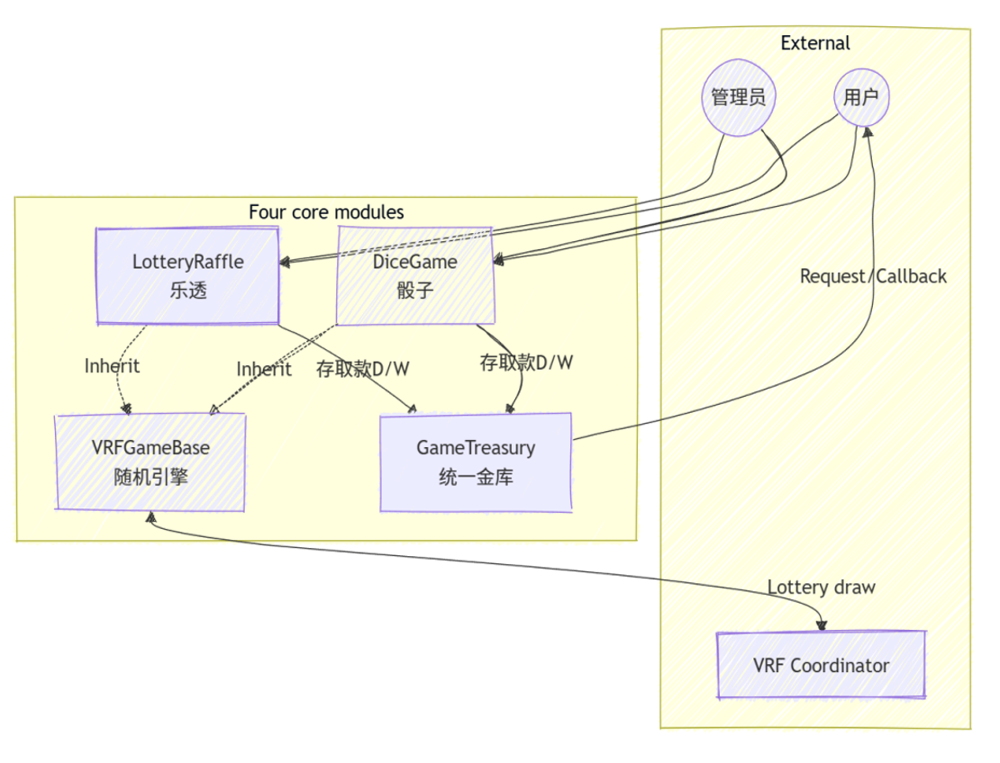

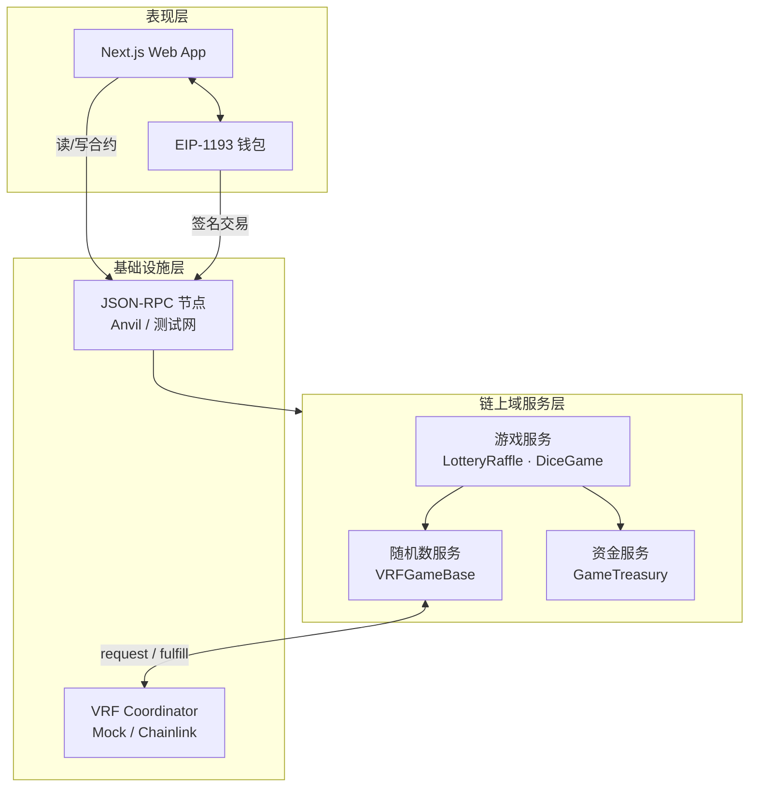

### 6.1 子系统职责

| 子系统 | 核心实体 | 职责 |
|--------|----------|------|
| **资金服务** | `GameTreasury` | 入金校验、池余额、派彩扣费、投注限额 |
| **随机数服务** | `VRFGameBase` | VRF 请求/回调/重试/证明存储 |
| **乐透游戏** | `LotteryRaffle` | 轮次状态机、加权抽签、滚存 |
| **骰子游戏** | `DiceGame` | Commit-Reveal、倍率结算 |
| **Web 客户端** | Next.js + wagmi | 交易构造、状态展示、证明查询 |
| **VRF 基础设施** | Coordinator | 提供不可预测随机字（生产为 Chainlink） |

### 6.2 组件依赖图

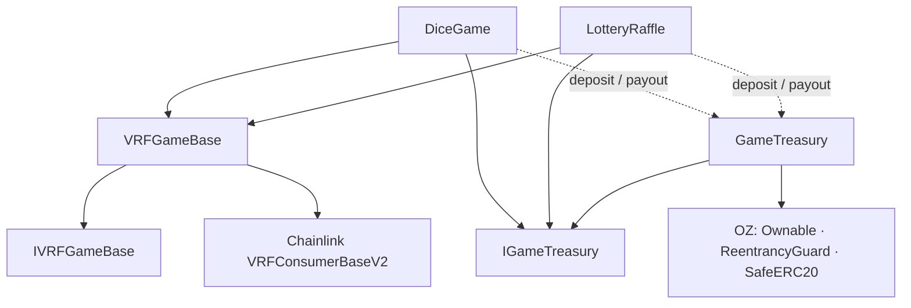

---

## 7. 域模型与状态设计

### 7.1 核心域概念

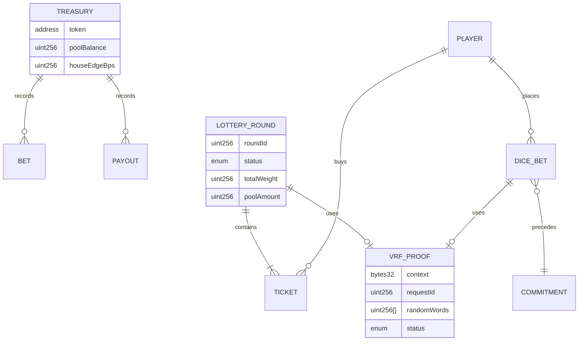

### 7.2 乐透轮次状态机（设计）

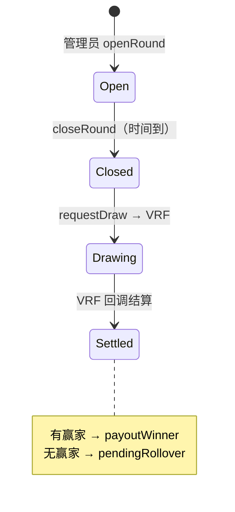

### 7.3 VRF 请求状态机（设计）

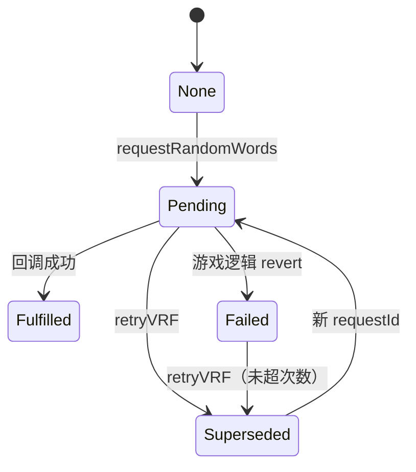

### 7.4 骰子投注状态（设计）

| 阶段 | 链上状态 | 说明 |
|------|----------|------|
| Commit | `commitments[player]` 含 hash | 不暴露预测 |
| 等待 | `block.number ≥ commitBlock + revealDelayBlocks` | 降低抢跑 |
| Reveal | `revealAndBet` + VRF Pending | 校验 hash、入金、请求随机数 |
| Settled | `bets[betId].settled = true` | 派彩或输掉本金 |

---

## 8. 关键设计决策（ADR 摘要）

| ADR | 决策 | 备选方案 | 理由 |
|-----|------|----------|------|
| ADR-01 | 使用 Chainlink VRF v2 消费者模式 | `blockhash`、Commit-Reveal  alone | 可验证、业界标准；骰子仍用 Commit-Reveal 保护**预测**而非**结果** |
| ADR-02 | 独立 `GameTreasury` | 各游戏自持余额 | 统一风控、house edge、授权白名单 |
| ADR-03 | `VRFGameBase` 抽象基类 | 每游戏复制 VRF 代码 | 减少重复；统一证明查询与重试 |
| ADR-04 | 本地 `MockVRFCoordinator` | 仅测试网 | 无 LINK、无订阅即可课堂演示 |
| ADR-05 | 乐透 O(n) 线性扫票 | Merkle 权重树 | 初版实现简单；n 大时 Gas 高（已知局限） |
| ADR-06 | 前端直连 RPC | 自建 BFF 后端 | 降低运维；符合去中心化 Demo 目标 |
| ADR-07 | Monorepo（contracts + frontend） | 分仓库 | 版本对齐、课程提交方便 |

---

## 9. 交互设计

### 9.1 资金交互（金库边界）

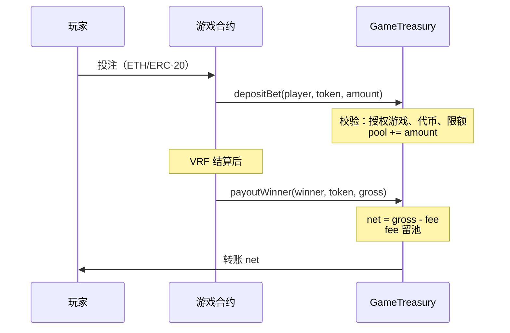

**设计约束**：仅 `authorizedGames` 可调用入金/派彩；`player` 与 `msg.sender` 分离以便审计。

### 9.2 乐透端到端

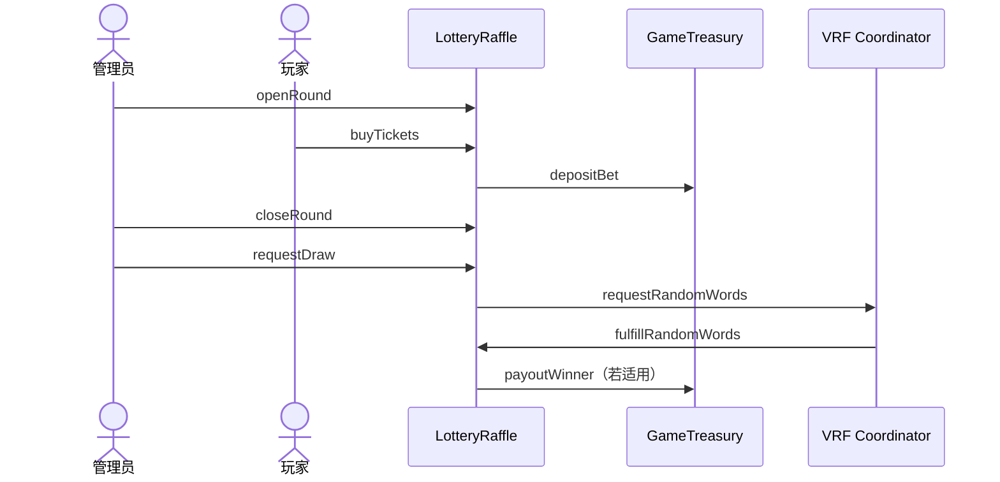

### 9.3 骰子 Commit-Reveal

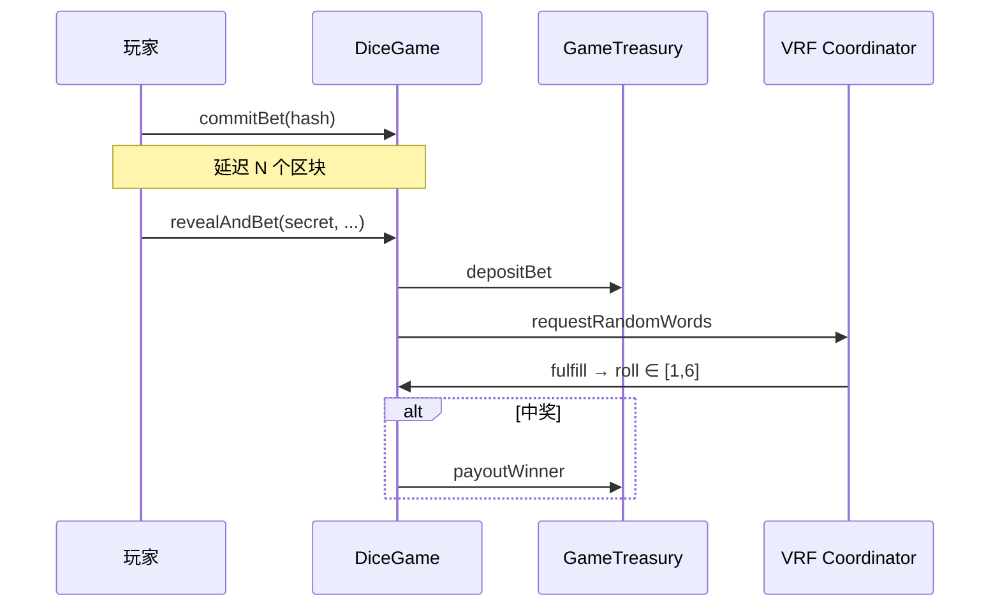

### 9.4 链—前端契约（Context）

为保证「VRF 证明」页可独立验证，**链上与前端必须使用相同编码**：

| 场景 | `context` |
|------|-----------|
| 乐透 `roundId` | `keccak256(abi.encode("LOTTERY_ROUND", lotteryAddr, roundId))` |
| 骰子 `betId` | `keccak256(abi.encode("DICE_BET", diceAddr, betId))` |
| 骰子 commitment | `keccak256(abi.encode(player, kind, target, secret, nonce))` |

前端实现：`frontend/src/lib/contracts/context.ts`。

---

## 10. 前端逻辑架构（设计视图）

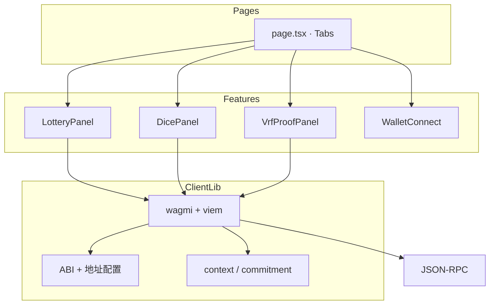

| 模块 | 设计职责 |
|------|----------|
| `providers.tsx` | 注入 Wagmi、React Query |
| `lottery-panel.tsx` | 轮次读取、购票/管理交易 |
| `dice-panel.tsx` | 本地生成 secret/nonce、两阶段交易 |
| `vrf-proof-panel.tsx` | 输入 context → `getVRFRecordByContext` |
| `wagmi/config.ts` | 链定义（Anvil 31337、Sepolia 预留） |

**配置契约**（`.env.local`）：`NEXT_PUBLIC_*_ADDRESS` 指向部署后的 Treasury / Lottery / Dice / VRF Coordinator。

---

## 11. 部署架构（设计视图）

### 11.1 逻辑部署单元

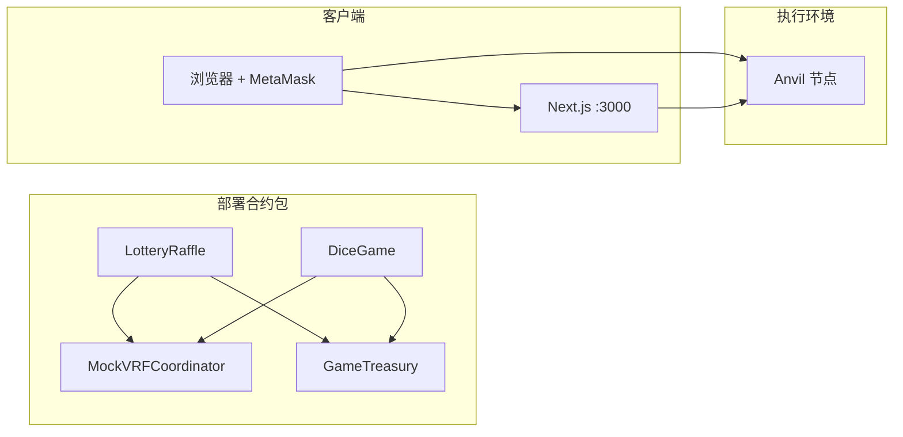

### 11.2 部署顺序（设计规定）

1. VRF Coordinator（本地 Mock / 测试网 Chainlink）
2. `GameTreasury(owner, houseEdgeBps)`
3. `LotteryRaffle`、`DiceGame`（注入 coordinator、treasury、VRF 参数）
4. `treasury.setGameAuthorized(game, true)` 对每个游戏
5. （可选）`setTokenSupported` / `setBetLimits` 用于 ERC-20
6. 乐透：`openRound` 后方可购票

### 11.3 环境矩阵

| 环境 | 链 | VRF | 用途 |
|------|-----|-----|------|
| 本地开发 | Anvil `31337` | MockVRFCoordinator | 默认 Demo、单元测试 |
| 测试网（预留） | Sepolia | Chainlink VRF v2 | 真实可验证随机（需订阅） |

---

## 12. 安全架构（设计层）

### 12.1 信任边界

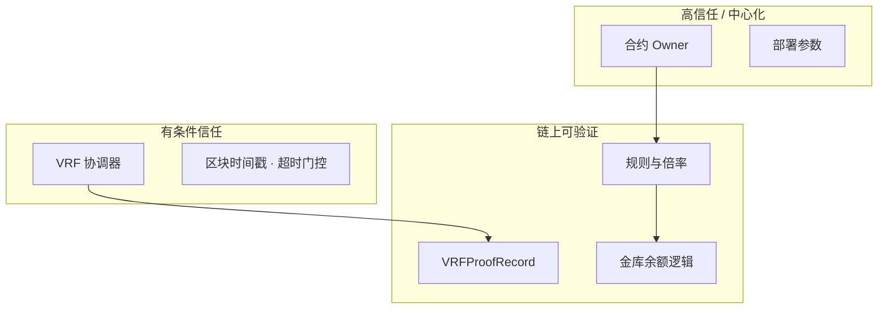

### 12.2 威胁与对策（设计）

| 威胁 | 对策 |
|------|------|
| 重入攻击 | `ReentrancyGuard`；金库/派彩 CEI |
| 未授权提池 | `onlyAuthorizedGame` |
| 骰子 mempool 窥探 | Commit-Reveal + `revealDelayBlocks` |
| VRF 回调恶意/失败 | `try/catch` → `Failed`；`retryVRF` 带上限 |
| 管理员滥权 | 初版仅 `onlyOwner`；演进：多签/Timelock |
| Mock VRF 伪造 | **仅 Demo**；生产必须换 Chainlink |

详细威胁建模见 [security-analysis.md](./security-analysis.md)。

---

## 13. 技术选型

| 层级 | 选型 | 选型理由 |
|------|------|----------|
| 合约语言 | Solidity 0.8.20 | 课程与生态标准；内置 overflow 检查 |
| 合约框架 | Foundry | 快测、脚本部署、`forge coverage` |
| 安全库 | OpenZeppelin 5.x | Ownable、ReentrancyGuard、SafeERC20 |
| 随机数 | Chainlink VRF v2 接口 | 可验证随机行业标准 |
| 前端 | Next.js 15 App Router | SSR/路由成熟、与 React 19 兼容 |
| 链交互 | wagmi 2 + viem | 类型安全、Hooks 贴合 React |
| 样式 | Tailwind + shadcn 风格 | 快速搭建 Demo UI |
| 仓库 | npm workspaces Monorepo | 合约与前端版本协同 |

---

## 14. 仓库结构（逻辑映射）

```text
verifiable-random-game/
├── contracts/              # 链上域服务实现
│   ├── src/treasury/       # 资金服务
│   ├── src/vrf/            # 随机数服务
│   ├── src/games/          # 游戏服务
│   ├── script/             # 部署编排
│   └── test/               # 验证设计约束
├── frontend/               # 表现层
│   └── src/
│       ├── app/            # 页面壳
│       ├── components/     # 功能面板
│       └── lib/            # wagmi、ABI、context
└── docs/                   # 设计 & API 文档
```

---

## 15. 测试策略（设计）

| 层次 | 手段 | 验证的设计约束 |
|------|------|----------------|
| 单元测试 | `forge test` | 状态机转移、revert 条件、派彩公式 |
| 集成测试 | Mock VRF fulfill | 端到端开奖/掷骰 |
| 不变量测试 | Handler + `invariant` | 金库池余额与入金/派彩一致 |
| 手动 Demo | 前端 + Anvil | 用例 UC-01～UC-06 |

---

## 16. 已知局限与演进路线

### 16.1 初版已知局限

| 领域 | 局限 |
|------|------|
| VRF | 本地 Mock 无 Chainlink 密码学证明 |
| 扩展性 | 乐透选票线性扫描，大规模参与 Gas 高 |
| 治理 | Owner 权限集中；乐透「管理员不购票」未链上强制 |
| 数据 | 无事件索引，历史依赖 RPC 轮询 |
| 持久化 | Anvil 重启状态丢失 |
| 代币 | 前端 Demo 以 ETH 为主 |

### 16.2 演进路线图

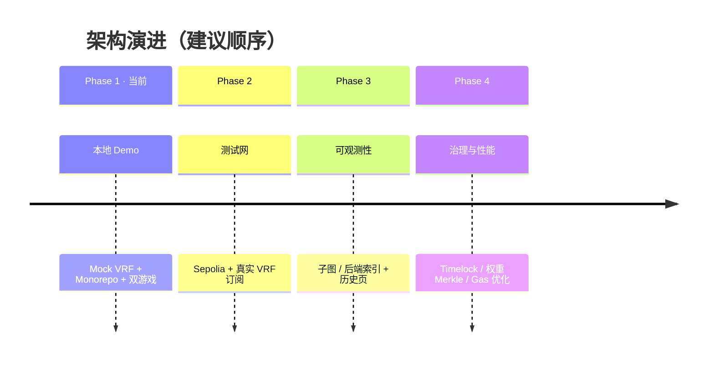

---

## 17. 实现追溯矩阵

设计子系统与代码路径对照，便于评审「设计—实现」一致性：

| 设计子系统 | 实现文件 |
|------------|----------|
| 资金服务 | `contracts/src/treasury/GameTreasury.sol` |
| 随机数服务 | `contracts/src/vrf/VRFGameBase.sol` |
| 乐透 | `contracts/src/games/LotteryRaffle.sol` |
| 骰子 | `contracts/src/games/DiceGame.sol` |
| 接口契约 | `contracts/src/interfaces/*.sol` |
| 部署编排 | `contracts/script/Deploy.s.sol` |
| Web 客户端 | `frontend/src/app/`, `frontend/src/components/` |
| Context 编码 | `frontend/src/lib/contracts/context.ts` |
| Mock VRF | `contracts/test/mocks/MockVRFCoordinator.sol` |

公开接口细节见 **[contracts.md](./contracts.md)**；环境与操作见 **[README.md](../README.md)**。

---

## 18. 修订记录

| 版本 | 日期 | 说明 |
|------|------|------|
| 1.0 | 2026-05 | 初版系统设计基线；与当前 Demo 实现同步 |

---

## 19. 相关文档

| 文档 | 内容 |
|------|------|
| [contracts.md](./contracts.md) | 智能合约 API |
| [security-analysis.md](./security-analysis.md) | 安全分析 |
| [README.md](../README.md) | 安装、部署、用户操作 |
