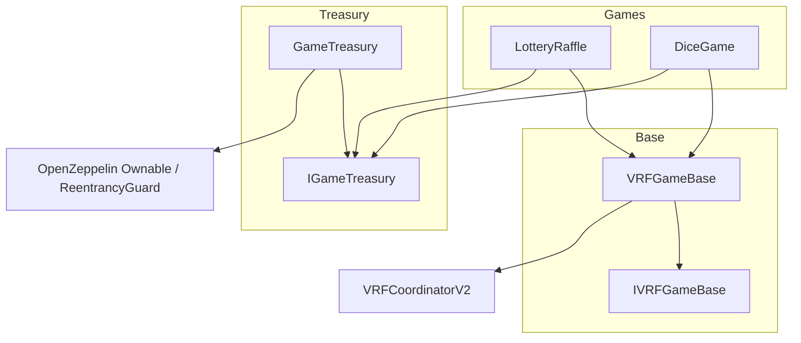

# 智能合约 API 文档

本文档描述 Verifiable Random Game 项目中**生产用**智能合约的公开接口、状态模型与交互流程。源码位于 `contracts/src/`，Solidity 版本 `^0.8.20`。

---

## 1. 合约总览

| 合约 | 路径 | 职责 |
|------|------|------|
| `GameTreasury` | `contracts/src/treasury/GameTreasury.sol` | 统一托管 ETH / ERC-20 投注资金，按庄家优势（house edge）向赢家派彩 |
| `VRFGameBase` | `contracts/src/vrf/VRFGameBase.sol` | Chainlink VRF v2 异步随机数基类：请求、证明存储、超时重试、回调失败标记 |
| `LotteryRaffle` | `contracts/src/games/LotteryRaffle.sol` | 时间窗口内加权乐透抽奖，VRF 开奖，无人中奖时滚存 |
| `DiceGame` | `contracts/src/games/DiceGame.sol` | Commit-Reveal 骰子投注，VRF 掷骰，按玩法倍率派彩 |
| `IGameTreasury` | `contracts/src/interfaces/IGameTreasury.sol` | 金库对外接口与事件/错误定义 |
| `IVRFGameBase` | `contracts/src/interfaces/IVRFGameBase.sol` | VRF 证明记录查询接口 |

本地 Demo 部署时使用 `contracts/test/mocks/MockVRFCoordinator.sol` 模拟 VRF 协调器，**不属于链上业务逻辑**，不在本文 API 范围内。

### 1.1 依赖关系



### 1.2 典型调用链

**乐透**

1. Owner `openRound` → 玩家 `buyTicketsWithETH` / `buyTicketsWithERC20` → 金库 `depositBet`
2. 到期后 `closeRound` → 任何人 `requestDraw` → VRF 回调 → 金库 `payoutWinner` 或滚存 `pendingRollover`

**骰子**

1. 玩家 `commitBet` → 等待 `revealDelayBlocks` → `revealAndBet` → 金库 `depositBet` + VRF 请求
2. VRF 回调 → 若中奖则金库 `payoutWinner`

---

## 2. 通用约定

| 约定 | 说明 |
|------|------|
| 原生代币 | `address(0)` 表示 ETH；金库中对应常量 `GameTreasury.NATIVE_TOKEN` |
| 权限 | `onlyOwner`：部署者或 `Ownable` 转移后的 owner；`onlyAuthorizedGame`：仅金库授权的游戏合约 |
| 重入 | 金库与 VRF 基类使用 `ReentrancyGuard`；游戏派彩/入金遵循 CEI（Checks-Effects-Interactions） |
| BPS | 万分比，`10_000` = 100%；庄家优势默认部署为 `200`（2%），上限 `500`（5%） |
| VRF Context | 各游戏用 `keccak256` 编码唯一上下文，用于关联 VRF 请求与业务状态（见 §5） |

---

## 3. IGameTreasury / GameTreasury

### 3.1 概述

`GameTreasury` 是投注资金池。仅**已授权**的游戏合约可调用 `depositBet` / `payoutWinner`。派彩时从毛额（gross）中扣除 `houseEdgeBps` 作为手续费留在池中。

### 3.2 常量与状态

| 名称 | 类型 | 可见性 | 说明 |
|------|------|--------|------|
| `NATIVE_TOKEN` | `address` | public | `address(0)`，表示 ETH |
| `MAX_HOUSE_EDGE_BPS` | `uint256` | public | 庄家优势上限 `500`（5%） |
| `houseEdgeBps` | `uint256` | public | 当前庄家优势（bps） |

### 3.3 事件

| 事件 | 参数 | 说明 |
|------|------|------|
| `GameAuthorized` | `game`, `authorized` | 游戏授权状态变更 |
| `TokenSupported` | `token`, `supported` | 代币是否支持投注 |
| `BetLimitsUpdated` | `token`, `minBet`, `maxBet` | 某代币投注上下限更新 |
| `BetReceived` | `game`, `player`, `token`, `amount` | 收到投注 |
| `PayoutSent` | `game`, `winner`, `token`, `netAmount`, `feeAmount` | 向赢家支付净额，手续费留在池内 |

### 3.4 错误

| 错误 | 触发条件 |
|------|----------|
| `UnauthorizedGame(address caller)` | 非授权游戏调用入金/派彩 |
| `UnsupportedToken(address token)` | 代币未支持，或 ERC-20 路径携带 `msg.value` |
| `BetBelowMinimum(uint256 amount, uint256 minBet)` | 投注低于下限 |
| `BetAboveMaximum(uint256 amount, uint256 maxBet)` | 投注高于上限或庄家优势超限 |
| `InsufficientPoolBalance(address token, uint256 required, uint256 available)` | 池余额不足以支付毛额派彩 |
| `TransferFailed()` | ETH 转出失败 |

### 3.5 构造函数

```solidity
constructor(address initialOwner, uint256 initialHouseEdgeBps)
```

| 参数 | 说明 |
|------|------|
| `initialOwner` | `Ownable` 所有者 |
| `initialHouseEdgeBps` | 初始庄家优势；须 `≤ MAX_HOUSE_EDGE_BPS` |

默认：ETH 已支持；`minBet = 0.001 ether`，`maxBet = 10 ether`。

### 3.6 管理员函数（onlyOwner）

#### `setHouseEdgeBps(uint256 newBps)`

更新庄家优势。`newBps` 不得超过 `MAX_HOUSE_EDGE_BPS`。

#### `setGameAuthorized(address game, bool authorized)`

授权或撤销游戏合约对金库的调用权限。部署后须对 `LotteryRaffle`、`DiceGame` 设为 `true`。

#### `setTokenSupported(address token, bool supported)`

启用或禁用某 ERC-20；ETH（`address(0)`）在构造函数中已启用。

#### `setBetLimits(address token, uint256 minBet_, uint256 maxBet_)`

设置某代币的最小/最大单笔投注；要求 `minBet_ ≤ maxBet_`。

#### `withdrawFees(address token, address to, uint256 amount)`

从池中提取资金（通常为累积的 house edge）。`nonReentrant`。

### 3.7 查询函数

#### `getPoolBalance(address token) → uint256`

返回某代币在池中的记账余额。

#### `getBetLimits(address token) → (uint256 minBet, uint256 maxBet)`

返回投注上下限。

#### `isGameAuthorized(address game) → bool`

#### `isTokenSupported(address token) → bool`

### 3.8 游戏专用函数（onlyAuthorizedGame）

#### `depositBet(address player, address token, uint256 amount)` — `payable`

| 参数 | 说明 |
|------|------|
| `player` | 实际玩家地址（用于事件索引） |
| `token` | `address(0)` 为 ETH，否则为 ERC-20 |
| `amount` | ETH 时若不为 0，须与 `msg.value` 一致；ERC-20 时从 `msg.sender`（游戏合约）`transferFrom` |

**行为**：校验支持代币与投注限额 → 增加 `_poolBalances[token]` → 发出 `BetReceived`。

#### `payoutWinner(address winner, address token, uint256 grossAmount)`

| 参数 | 说明 |
|------|------|
| `winner` | 赢家地址 |
| `token` | 派彩代币 |
| `grossAmount` | 毛派彩额；`fee = grossAmount * houseEdgeBps / 10000`，净额 `net = grossAmount - fee` 转给赢家 |

**行为**：若 `grossAmount == 0` 直接返回；否则扣减池余额并转出 `net`。`fee` 留在池中。

### 3.9 `receive() external payable`

直接向金库发送的 ETH 会计入 `NATIVE_TOKEN` 池余额（不经过 `depositBet`）。

---

## 4. IVRFGameBase / VRFGameBase

### 4.1 概述

抽象基类，继承 `VRFConsumerBaseV2`、`Ownable`、`ReentrancyGuard`。子合约通过 `_requestRandomness` 发起请求，在 `fulfillRandomWords` 中经 `try/catch` 调用子类 `_onRandomWordsFulfilled`。失败时记录为 `VRFStatus.Failed`，可超时后 `retryVRF`（最多 3 次）。

### 4.2 类型与状态

#### `VRFStatus` 枚举

| 值 | 含义 |
|----|------|
| `None` | 无请求 |
| `Pending` | 已请求，等待回调 |
| `Fulfilled` | 随机数已返回且回调成功 |
| `Failed` | 回调 revert |
| `Superseded` | 已被重试请求替代 |

#### `VRFProofRecord` 结构体

| 字段 | 类型 | 说明 |
|------|------|------|
| `requestId` | `uint256` | Chainlink 请求 ID |
| `context` | `bytes32` | 游戏上下文 |
| `randomWords` | `uint256[]` | VRF 返回的随机字 |
| `status` | `VRFStatus` | 当前状态 |
| `requestedAt` | `uint64` | 请求时间戳 |
| `fulfilledAt` | `uint64` | 完成时间戳 |
| `retryCount` | `uint8` | 重试次数 |
| `supersededByRequestId` | `uint256` | 若被替代，指向新 requestId |

#### 公开状态

| 名称 | 类型 | 说明 |
|------|------|------|
| `vrfTimeoutSeconds` | `uint256` | 超时后可重试的秒数 |

### 4.3 事件

| 事件 | 说明 |
|------|------|
| `VRFRequested(context, requestId, retryCount)` | 新 VRF 请求 |
| `VRFFulfilled(context, requestId, randomWords)` | 随机数到位 |
| `VRFFailed(context, requestId, reason)` | 游戏回调失败 |
| `VRFRetried(context, oldRequestId, newRequestId)` | 超时/失败后重试 |

### 4.4 错误

| 错误 | 说明 |
|------|------|
| `VRFRequestStillPending(bytes32 context)` | 仍在等待且未超时 |
| `VRFRequestNotRetryable(bytes32 context)` | 无活跃请求或已完成 |
| `VRFMaxRetriesExceeded(bytes32 context)` | 已达 `MAX_VRF_RETRIES`（3） |
| `VRFContextAlreadyPending(bytes32 context)` | 同 context 已有 Pending 请求 |
| `InvalidVRFConfig()` | 构造或 `setVrfTimeoutSeconds(0)` 等非法配置 |

### 4.5 构造函数（internal，由子合约调用）

```solidity
constructor(
    address vrfCoordinator,
    address initialOwner,
    bytes32 keyHash,
    uint64 subscriptionId,
    uint16 requestConfirmations,
    uint32 callbackGasLimit,
    uint32 numWords,
    uint256 timeoutSeconds
)
```

要求：`timeoutSeconds > 0`、`numWords > 0`、`callbackGasLimit >= 50_000`。

### 4.6 公开函数

#### `getVRFRecordByContext(bytes32 context) → VRFProofRecord`

按游戏上下文返回当前活跃请求的记录；无请求时返回 `status = None` 的空记录。

#### `getVRFRecordByRequestId(uint256 requestId) → VRFProofRecord`

按 Chainlink `requestId` 查询完整记录（含历史/被替代请求）。

#### `getActiveRequestId(bytes32 context) → uint256`

返回 context 下当前活跃的 `requestId`；无则为 `0`。

#### `setVrfTimeoutSeconds(uint256 newTimeout)` — `onlyOwner`

更新超时阈值；`newTimeout` 不可为 0。

#### `retryVRF(bytes32 context)` — `nonReentrant`

在以下条件下发起新请求：存在活跃请求；状态非 `Fulfilled`；若仍为 `Pending` 则须已超过 `vrfTimeoutSeconds`；`retryCount < 3`。旧记录标记为 `Superseded` 并链接新 `requestId`。

### 4.7 内部扩展点（非公开 API）

| 函数 | 说明 |
|------|------|
| `_requestRandomness(bytes32 context, uint8 retryCount)` | 向协调器请求随机数 |
| `_onRandomWordsFulfilled(bytes32 context, uint256 requestId, uint256[] randomWords)` | **子合约必须实现**的游戏结算逻辑 |

---

## 5. VRF Context 编码

前端或索引器可用下列规则复现 `context`，进而调用 `getVRFRecordByContext`：

| 游戏 | 编码 |
|------|------|
| 乐透第 `roundId` 轮 | `keccak256(abi.encode("LOTTERY_ROUND", lotteryAddress, roundId))` |
| 骰子第 `betId` 注 | `keccak256(abi.encode("DICE_BET", diceAddress, betId))` |

---

## 6. LotteryRaffle

### 6.1 概述

按**投注金额加权**的限时乐透。每轮结束后通过 VRF 在 `[0, totalWeight)` 上选点确定赢家；无票或选点异常时奖池滚入 `pendingRollover` 供下一轮使用。

继承：`VRFGameBase`。不可变引用：`treasury`。VRF 默认超时：`1 hours`，每次请求 `numWords = 1`。

### 6.2 类型

#### `RoundStatus`

| 值 | 含义 |
|----|------|
| `Open` | 可购票 |
| `Closed` | 已截止，可请求开奖 |
| `Drawing` | 已请求 VRF |
| `Settled` | 已结算（含滚存） |

#### `Round` 结构体（public mapping `rounds`）

| 字段 | 说明 |
|------|------|
| `startTime`, `endTime` | 售票窗口（Unix 秒） |
| `status` | 轮次状态 |
| `paymentToken` | `address(0)` 或 ERC-20 |
| `totalWeight` | 累计权重（等于投注额之和） |
| `poolAmount` | 本轮奖池（含 `rolloverIn`） |
| `rolloverIn` / `rolloverOut` | 滚入/滚出金额 |
| `winner` | 赢家；滚存时为 `address(0)` |
| `winnerPayout` | 派彩额 |
| `vrfRequestId` | 本轮 VRF 请求 ID |

### 6.3 公开状态

| 名称 | 说明 |
|------|------|
| `treasury` | `IGameTreasury` 地址 |
| `currentRoundId` | 当前/最近轮次 ID |
| `pendingRollover` | 待并入下一轮的滚存金额 |
| `rounds(roundId)` | 轮次详情 |

### 6.4 自定义错误

| 错误 | 说明 |
|------|------|
| `RoundNotOpen` | 轮次非 Open |
| `RoundStillOpen` | 未到 `endTime` 却尝试关闭 |
| `RoundNotClosed` | 非 Closed 却请求开奖 |
| `InvalidRoundTiming` | 时间配置非法或购票不在窗口内 |
| `InvalidPayment` | 代币或金额不匹配 |
| `RoundNotDrawing` | VRF 回调时状态不对 |
| `NoActiveRound` | 尚无已开启轮次 |
| `AmountTooLarge` | 单笔投注超过 `uint96` |

### 6.5 事件

| 事件 | 说明 |
|------|------|
| `RoundOpened` | 新轮开启 |
| `TicketPurchased` | 购票 |
| `RoundClosed` | 轮次关闭 |
| `DrawRequested` | 已请求 VRF |
| `RoundSettled` | 结算完成（含滚存） |

### 6.6 构造函数

```solidity
constructor(
    address vrfCoordinator,
    address initialOwner,
    address treasury_,
    bytes32 keyHash,
    uint256 subscriptionId,
    uint16 requestConfirmations,
    uint32 callbackGasLimit
)
```

将 `subscriptionId` 传入 `VRFGameBase`（内部为 `uint64`）。

### 6.7 函数 API

#### `openRound(uint64 startTime, uint64 endTime, address paymentToken) → uint256 roundId` — `onlyOwner`

开启新轮：`roundId = ++currentRoundId`，将 `pendingRollover` 并入 `poolAmount`。要求 `endTime > startTime`。

#### `buyTicketsWithETH()` — `payable`

使用 ETH 购票；内部调用 `_buyTickets(address(0), msg.value)`。权重 = 投注额。

#### `buyTicketsWithERC20(address token, uint256 amount)`

使用 ERC-20 购票：玩家 → 本合约 → `approve` → 金库 `depositBet`。

**购票条件**：`currentRoundId > 0`；当前轮 `Open`；`block.timestamp ∈ [startTime, endTime)`；`paymentToken == token`；金额在金库限额内。

#### `closeRound(uint256 roundId)`

轮次 `Open` 且 `block.timestamp >= endTime` 时设为 `Closed`。

#### `requestDraw(uint256 roundId)`

轮次 `Closed` → `Drawing`，计算 context 并 `_requestRandomness`。

#### `ticketCount(uint256 roundId) → uint256`

#### `getTicket(uint256 roundId, uint256 index) → (address player, uint96 weight)`

### 6.8 开奖逻辑（`_onRandomWordsFulfilled`）

1. `winningPoint = randomWords[0] % totalWeight`
2. 按购票顺序累加 `weight`，第一个使 `accumulated > winningPoint` 的票为赢家
3. 赢家非零：`payout = poolAmount`，`treasury.payoutWinner`
4. 否则：`pendingRollover += poolAmount`

---

## 7. DiceGame

### 7.1 概述

**两阶段**投注：先 `commitBet` 隐藏预测，经过 `revealDelayBlocks` 后 `revealAndBet` 揭示并扣款，VRF 产生 1–6 点骰面。VRF 默认超时 `30 minutes`。

### 7.2 类型

#### `BetKind`

| 值 | 规则 | 默认倍率（bps，派彩前） |
|----|------|-------------------------|
| `Exact` | `roll == target`，`target ∈ [1,6]` | `58_800`（约 5.88×） |
| `Over` | `roll > 3` | `19_600`（约 1.96×） |
| `Under` | `roll < 4` | `19_600` |

实际到手 = `grossPayout * (1 - houseEdgeBps/10000)`，由金库在 `payoutWinner` 扣除。

#### `Commitment`（`commitments[player]`）

| 字段 | 说明 |
|------|------|
| `commitment` | `keccak256(abi.encode(player, kind, target, secret, nonce))` |
| `commitBlock` | 提交时的区块号 |
| `revealed` | 是否已 reveal |

#### `ActiveBet`（`bets[betId]`）

| 字段 | 说明 |
|------|------|
| `player`, `token`, `amount` | 玩家、代币、本金 |
| `kind`, `target` | 玩法与 Exact 时的目标点数 |
| `settled` | 是否已结算 |

### 7.3 常量

| 名称 | 值 | 说明 |
|------|-----|------|
| `MULTIPLIER_EXACT_BPS` | `58_800` | Exact 毛倍率分子 |
| `MULTIPLIER_OVER_UNDER_BPS` | `19_600` | Over/Under 毛倍率分子 |
| `BPS_DENOMINATOR` | `10_000` | 倍率分母 |

### 7.4 公开状态

| 名称 | 说明 |
|------|------|
| `treasury` | 金库地址 |
| `revealDelayBlocks` | commit 与 reveal 之间最少间隔区块数 |
| `nextBetId` | 下一注 ID |
| `commitments`, `bets` | 映射 |

### 7.5 自定义错误

`InvalidCommitment`、`CommitmentAlreadyExists`、`NoCommitment`、`RevealTooEarly`、`AlreadyRevealed`、`InvalidTarget`、`InvalidAmount`、`BetNotFound`、`BetAlreadySettled`。

### 7.6 构造函数

```solidity
constructor(
    address vrfCoordinator,
    address initialOwner,
    address treasury_,
    bytes32 keyHash,
    uint64 subscriptionId,
    uint16 requestConfirmations,
    uint32 callbackGasLimit,
    uint256 revealDelayBlocks_
)
```

`revealDelayBlocks_ == 0` 时默认为 `3`。

### 7.7 函数 API

#### `setRevealDelayBlocks(uint256 blocks_)` — `onlyOwner`

更新 reveal 延迟区块数。

#### `commitBet(bytes32 commitment)`

提交承诺哈希；不可为零；同一玩家在未 reveal 前不能重复 commit。

#### `revealAndBet(bytes32 secret, uint256 nonce, BetKind kind, uint8 target, address token, uint256 amount)` — `payable` → `uint256 betId`

| 步骤 | 说明 |
|------|------|
| 校验 | 存在 commitment、未 reveal、`block.number >= commitBlock + revealDelayBlocks` |
| 哈希 | `keccak256(abi.encode(msg.sender, kind, target, secret, nonce)) == commitment` |
| 投注 | Exact 时 `target ∈ [1,6]`；创建 `betId`；入金并 `_requestRandomness` |

**Commit 计算公式（链下/前端）**：

```text
commitment = keccak256(abi.encode(player, kind, target, secret, nonce))
```

#### 结算（`_onRandomWordsFulfilled`）

- `roll = (randomWords[0] % 6) + 1`
- 未中奖：仅发 `DiceRollSettled(..., won=false)`
- 中奖：`grossPayout = amount * multiplierBps / 10000`，`treasury.payoutWinner`

---

## 8. 部署后配置清单

部署脚本见 `contracts/script/Deploy.s.sol`。链上需完成：

1. `GameTreasury` 部署并设置 `houseEdgeBps`
2. `LotteryRaffle`、`DiceGame` 部署并传入 `treasury` 与 VRF 参数
3. `treasury.setGameAuthorized(lottery, true)` 与 `setGameAuthorized(dice, true)`
4. 若使用 ERC-20：`setTokenSupported(token, true)` 与 `setBetLimits`
5. 乐透：Owner 调用 `openRound` 后玩家方可购票

---

## 9. 源码 NatSpec 对照

合约源码中已对核心合约使用 `@title` / `@notice` / `@inheritdoc` 注释。本文档与下列文件保持同步，完整公开接口以源码为准：

| 文件 | 已文档化的公开入口 |
|------|-------------------|
| `GameTreasury.sol` | 构造、admin、view、`depositBet`、`payoutWinner`、`receive` |
| `VRFGameBase.sol` | VRF 查询、`setVrfTimeoutSeconds`、`retryVRF` |
| `LotteryRaffle.sol` | 轮次生命周期、购票、查询 |
| `DiceGame.sol` | commit-reveal、倍率常量、结算 |
| `IGameTreasury.sol` / `IVRFGameBase.sol` | 接口级 `@notice` 与事件/错误 |

---

## 10. 相关文档

| 文档 | 状态 |
|------|------|
| [architecture.md](./architecture.md) | 系统架构（待补全） |
| [security-analysis.md](./security-analysis.md) | 安全分析（待补全） |
| [README.md](../README.md) | 环境搭建与运行指南 |
